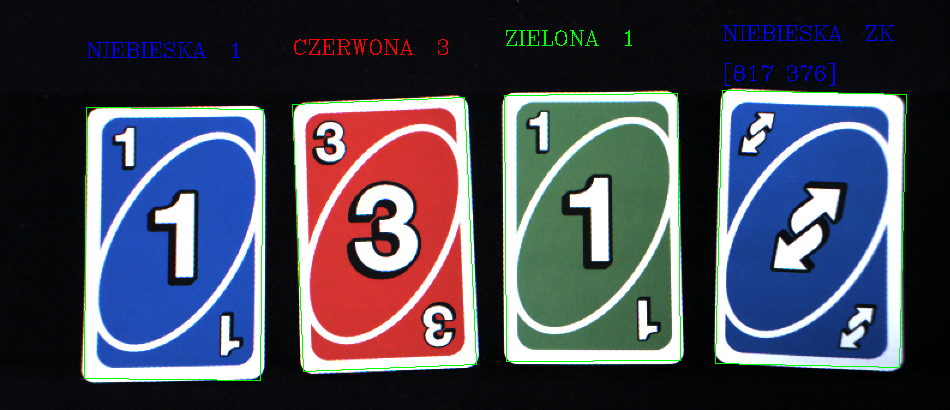
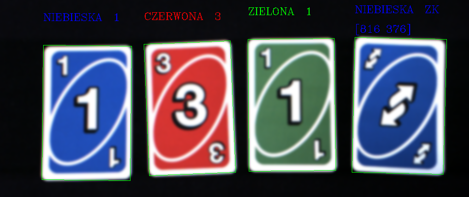

# UNO Card Recognition - Digital Image Processing Project

## Author
Oleg Łyżwiński

## Project Description
This project focuses on developing a Python-based application capable of recognizing UNO cards from images taken during a laboratory session. The images contain four cards arranged in a line, with additional filters applied to complicate recognition, such as gradient, salt-and-pepper noise, and blur. The goal was to accurately identify the cards' symbols and colors despite these challenges.

## Project Structure
The repository contains the following files:
- **CMPO_2_Oleg_Łyżwiński.pdf**: A detailed report (in Polish) describing the project's methodology, algorithms, and results.
- **Images**: A set of images used for testing, including:
  - `1.png`, `1_blur.png`, `1_gradient.png`, `1_salt_pepper.png`: Example images with different filters applied.
- **Results**: Recognized cards.

## Example Image
Below is an example of the input image (`1.png`) used in the project:

This image contains four UNO cards arranged in a line, which the algorithm processes to detect and recognize the cards.

## Algorithm Overview
The project involves several key steps:
1. **Card Detection**:
   - Edge detection and contour extraction to isolate individual cards.
   - Use of filters like unsharp mask, thresholding, erosion, and Canny edge detection to enhance card boundaries.
   
2. **Symbol Recognition**:
   - Perspective transformation to align cards.
   - Image preprocessing (blurring, histogram equalization, adaptive thresholding) to highlight symbols.
   - Masking and contour analysis to extract and recognize symbols using Hu moments.

3. **Color Recognition**:
   - Conversion of card images to the HSV color space.
   - Sampling a small region of the card to determine the average color.
   - Conditional logic to classify the card's color.

4. **Center Detection**:
   - Calculation of the card's center coordinates, accounting for image resizing during processing.

## Block Diagram
The project follows a structured workflow, as illustrated in the block diagram included in the report (`CMPO_2_Oleg_Łyżwiński.pdf`).

## Results
The algorithm successfully recognizes UNO cards from the provided images, even with applied filters. Below are examples of the output for different image sets:

